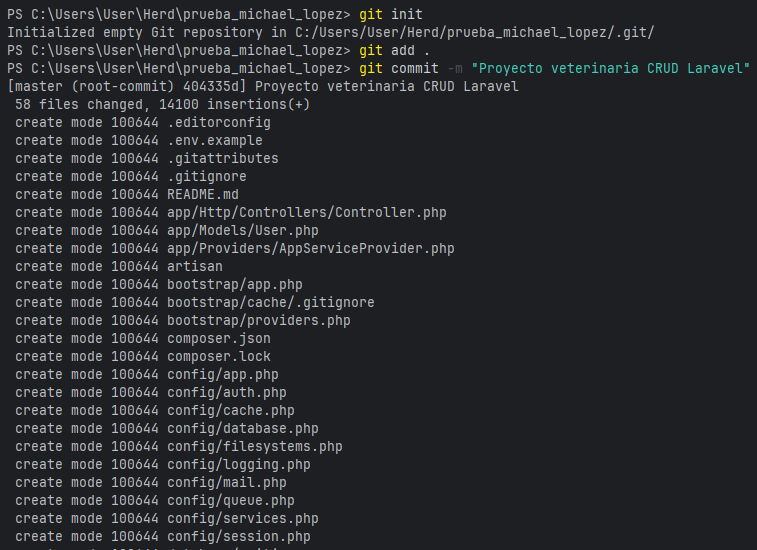
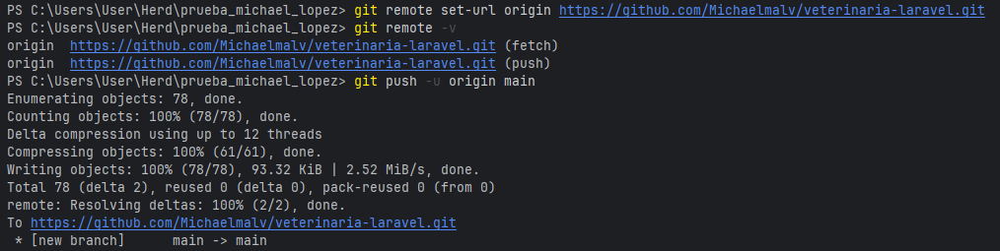
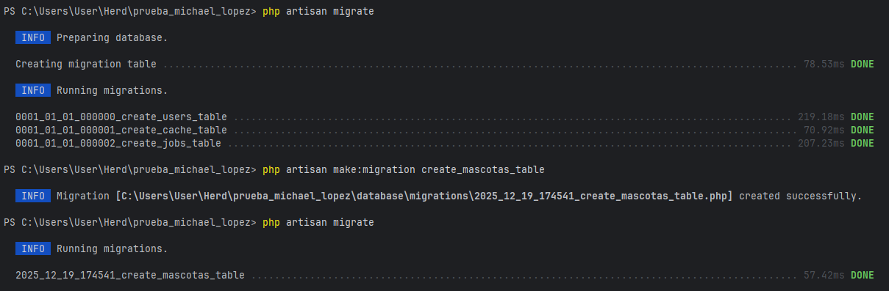
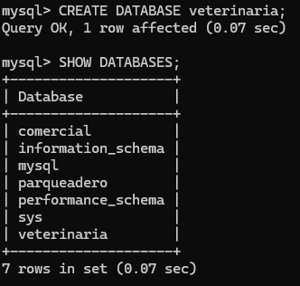
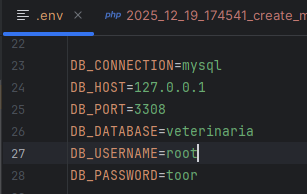
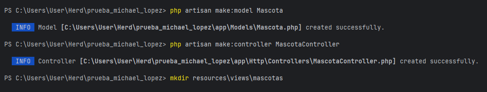

    # Sistema Veterinario – Huellitas Felices
Repositorio en GitHub:  
https://github.com/Michaelmalv/veterinaria-laravel.git

Proyecto desarrollado en Laravel como práctica de CRUD y arquitectura MVC.

## Caso
Clínica veterinaria **Huellitas Felices**.  
El sistema permite registrar y administrar la información básica de las mascotas que llegan a consulta.

## Objetivo
Reemplazar el registro manual en papel por un sistema web sencillo que permita:
- Registrar mascotas
- Ver un listado
- Editar información
- Dar de baja registros sin eliminarlos

## Arquitectura
El proyecto sigue el patrón **MVC**:
- Modelo: Mascota
- Controlador: MascotaController
- Vistas: Blade con Bootstrap
- Base de datos: MySQL

## Base de datos

**Tabla:** mascotas

Campos principales:
- nombre_mascota
- especie
- raza
- edad
- nombre_dueno
- telefono
- observaciones
- activo
- created_at

## Política de eliminación
Los registros no se eliminan físicamente.  
Se utiliza un campo `activo` para marcar las mascotas que ya no están en atención.

## Capturas del sistema
PrimerGitCommit

ConexionGitHub

Migracion

CreacionBaseDatos

ConexionBaseDatos

CreacionMVC

## Tecnologías usadas
- Laravel
- PHP
- MySQL
- Bootstrap
- GitHub

